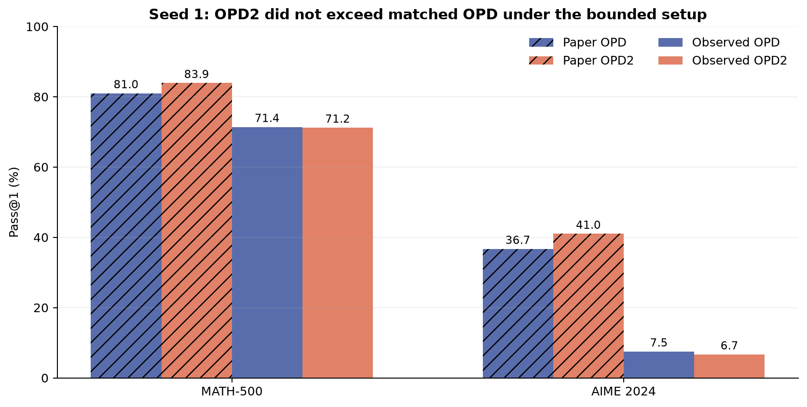
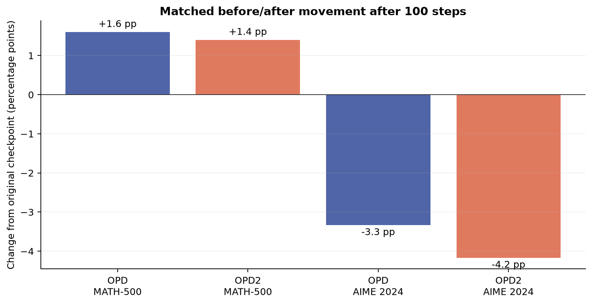
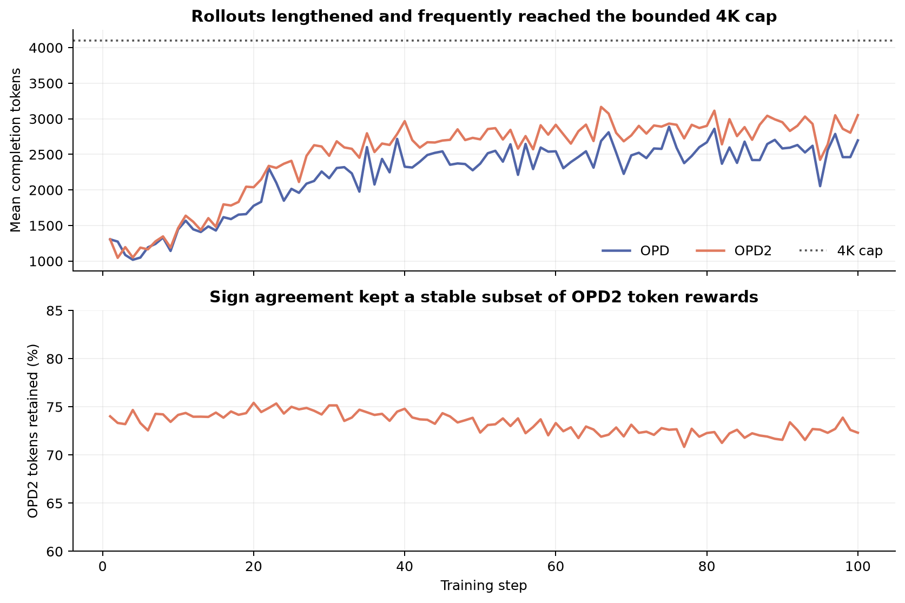
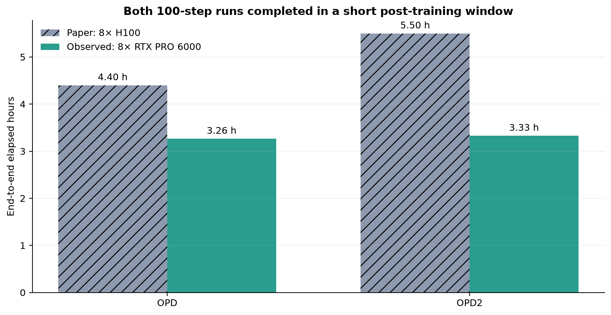

# On-Policy Delta Distillation on Qwen3-1.7B: a bounded reproduction



[](https://molab.marimo.io/github/rehaanahmad2013/on-policy-delta-distillation/blob/main/notebooks/opd2_reproduction.py)

The paper [*On-Policy Delta Distillation*](https://arxiv.org/abs/2607.15161) asks whether a student should imitate everything its instruction-tuned teacher knows, or only what the teacher learned beyond its own base model. Its answer is OPD2: score each sampled student token by the teacher-minus-base log-probability change, center the score over a top-k vocabulary, and retain tokens whose ordinary teacher advantage has the same sign. The paper reports that this change improves Qwen3-1.7B over ordinary on-policy distillation (OPD).

Our first matched 100-step seed did **not show that quality advantage under the bounded setup**. OPD2 was 0.2 percentage points below OPD on MATH-500 and 0.83 points below it on AIME 2024. The runtime claim did align: OPD2 finished in 3.327 hours end to end, just 1.96% slower than OPD's 3.263 hours. A second matched seed was launched to test whether the small quality differences persist; its results are incorporated in the final assessment below.

All experiments used the OpenResearch Kubernetes backend. Each method used 8 NVIDIA RTX PRO 6000 Blackwell GPUs, with a peak of 16 GPUs concurrently allocated. Exact run commands and branch links appear in the [public README](../../README.md).

## Evidence at a glance

| Claim | Paper evidence | Observed seed 1 | Assessment |
|---|---:|---:|---|
| OPD2 beats OPD on MATH-500 | 83.9 vs 81.0 (+2.9 pp) | 71.2 vs 71.4 (−0.2 pp) | Inconclusive under this setup |
| OPD2 beats OPD on AIME 2024 | 41.0 vs 36.7 (+4.3 pp) | 6.67 vs 7.50 (−0.83 pp) | Inconclusive under this setup |
| OPD2 remains a short 100-step run | 5.5 h vs 4.4 h on 8× H100 | 3.327 h vs 3.263 h on 8× RTX PRO 6000 | Aligned |

The matched starting checkpoint scored 69.8% on MATH-500 and 10.83% on AIME24 in both jobs. OPD improved MATH-500 by 1.6 points and OPD2 by 1.4 points. Both moved backward on the small AIME evaluation, where four repetitions yield only 120 samples.



## What was implemented

The unavailable author repository prevented a line-for-line TRL reproduction. We therefore implemented the paper's token objective directly with PyTorch and Transformers SDPA generation. The baseline and treatment branches differ in one reviewed configuration field, `method: opd` versus `method: opd2`.

For a student-sampled token, the implementation computes:

```python
opd_reward = logp_teacher[token] - mean_topk(logp_teacher)
delta = logp_teacher - logp_teacher_base
delta_reward = delta[token] - mean_topk(delta)
active = sign(delta_reward) == sign(opd_reward)
advantage = reward_scale * delta_reward * active
loss = -(advantage.detach() * logp_student[token])
```

This follows the paper's centered teacher-minus-base reward and joint sign gate. Rewards are centered over the top 1,024 teacher tokens; the reward scale is 0.1, KL coefficient is zero, sampling temperature is 0.7, and the learning-rate schedule matches the paper (AdamW, 5×10⁻⁶ peak, 10% warmup, cosine decay to 10% of peak, unit gradient clipping).

Prompts were drawn without answers in a strict 1:1:1 interleave from the public `nvidia/OpenMathReasoning`, `nvidia/OpenScienceReasoning-2`, and `nvidia/OpenCodeReasoning` datasets. Every one of the 6,400 consumed questions per run was unique; domain counts were 2,134 math, 2,133 science, and 2,133 code.

## Consequential substitutions

The scientific comparison kept models, prompt order, optimizer, number of steps, sampling temperature, reward scaling, centering, and evaluation identical. Two changes bounded wall time on the available cluster:

| Setting | Paper | Reproduction | Consequence |
|---|---:|---:|---|
| Global batch | 256 | 64 | 6,400 rather than 25,600 sampled prompts |
| Maximum rollout | 8,192 | 4,096 tokens | Long reasoning traces can be truncated |
| Rollout engine | TRL + colocated vLLM | direct PyTorch + Transformers SDPA | Different systems performance |
| Evaluation | 14 benchmarks, repeated | MATH-500 once; AIME24 four times | Narrower and noisier quality estimate |
| Seeds | not the paper's public artifacts | two matched seeds | Robustness check, not exact paper randomness |

Before downscaling, one full-setting profile step was run for each method at batch 256 and 8K completions. OPD took 644.17 seconds and OPD2 651.33 seconds, a 1.11% increment for the extra teacher-base pass. Those profiles established feasibility but were intentionally stopped after one step so the claim-critical matched 100-step pair could finish.

## Training behavior and diagnostics



OPD2's joint sign gate retained 73.32% of tokens on average in seed 1, ranging from 70.84% to 75.89%. The gate did not collapse. Pre-clip gradient norms stayed finite; maxima were 2.31 for OPD and 1.32 for OPD2, with the configured unit clipping applied.

The bounded rollout length is a real limitation, not a cosmetic setting. At least one completion reached 4,096 tokens in 61 of 100 OPD batches and 73 of 100 OPD2 batches. Average completion length was 2,222 tokens for OPD and 2,495 for OPD2. This changes the on-policy data distribution and is a plausible reason the paper's quality ordering did not appear.

## Runtime evidence



| Method | Training | Setup + before/after evaluation | End to end | Relative to OPD |
|---|---:|---:|---:|---:|
| OPD | 3.039 h | 0.224 h | 3.263 h | — |
| OPD2 | 3.094 h | 0.233 h | 3.327 h | +1.96% total |

The paper reports 4.4 hours for OPD and 5.5 hours for OPD2 on eight H100s, a 25% increment. On eight RTX PRO 6000 Blackwell GPUs, this implementation's extra base forward pass added 3.30 seconds to the median step (111.55 vs 109.77 seconds) and 197.67 seconds across training. OPD2 generated longer completions on average, so total time combines method cost with a changed sampled-token workload. Even so, both 100-step jobs completed in a short post-training window.

## Claim-by-claim assessment

**Teacher-minus-base delta rewards outperform ordinary OPD.** The first bounded seed did not show the reported direction: OPD2 trailed by 0.2 points on MATH-500 and 0.83 points on AIME24. Both differences are small relative to the evaluation's sampling and training variance, especially AIME's 120 samples. Because the run used one quarter of the paper's batch and half its rollout limit, the appropriate assessment is **inconclusive under this setup**, not a claim about the full paper recipe.

**The extra base forward pass preserves a short post-training window.** This was **aligned**. OPD2 completed 100 steps in 3.094 training hours and 3.327 hours end to end on eight RTX PRO 6000 Blackwell GPUs. The matched OPD job took 3.039 and 3.263 hours. The full-setting one-step profile independently showed a 1.11% step-time increment.

## What a full reproduction still needs

A decisive test of the quality claim would use the paper's global batch 256 and 8,192-token rollouts for all 100 steps, the author's eventual TRL/vLLM implementation, the complete 14-benchmark suite with the paper's repeated-sampling protocol, and multiple training seeds. The public-dataset prompt fields should also be checked against the author's exact preprocessing once their repository is released.

## Reproducibility and provenance

The source, frozen configurations, structured result data, figure renderer, and self-contained tutorial notebook are in the public repository. The notebook opens with embedded evidence and does not require readers to rerun training. Launch commands are reproduced verbatim from `orx exp status` in the README; raw run IDs and setup lineage remain in OpenResearch experiment descriptions.

Kubernetes was used throughout. GPU model: NVIDIA RTX PRO 6000 Blackwell. Peak concurrent GPU count: 16. Actual elapsed campaign wall time is reported in `autoresearch.json` and the README after the robustness pair finishes.
